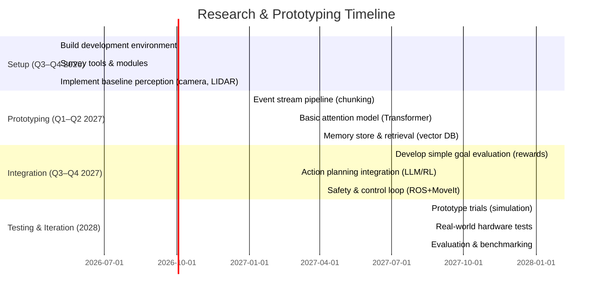
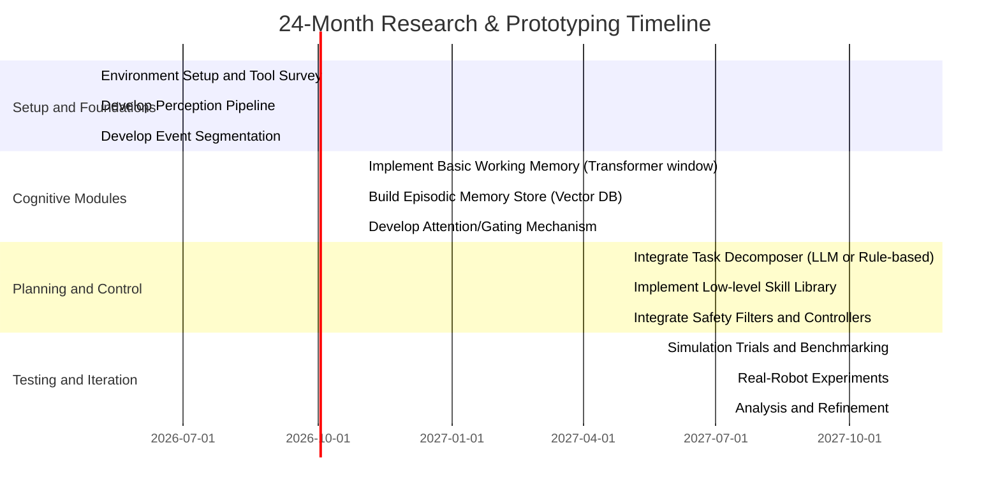

# Executive Summary  
The proposed architecture envisions a **continuous perception stream** of events, with a **dynamic working set** (attention) selecting relevant chunks for processing, guided by **motivational/emotional evaluation** and yielding planned actions. In effect, it combines ideas from cognitive architectures (memory+attention) with modern ML (transformers, world models) and robotics (behavior-based layers). In practice, today’s systems offer fragments of this vision. Modern robots excel at perception (object/scene understanding with deep nets) and low-level control (trajectory planners, reinforcement learning) but lack a unified “mind‐like” cognition. Large Foundation Models (LLMs, vision-language models) provide powerful perception and planning primitives, yet they struggle with long-term memory, continual learning, and real-time embodiment【27†L75-L80】【28†L1-L4】. By contrast, classical cognitive architectures (Soar, ACT-R/E, LIDA, CRAM, etc.) and predictive/active inference theories explicitly model working memory, attention, and goal‐driven behavior【9†L125-L134】【45†L101-L110】. No single system currently realizes all components of the proposed design. Feasibility thus lies in **hybrid solutions**: combining engineered modules (symbolic planners, safety monitors) with learnable components (neural perception, attention, world models). In the near term (1–3 years), prototypes could be built by integrating existing perception, memory retrieval, and planning tools (e.g. ROS/MoveIt, vision transformers, vector DBs, reinforcement learners). Longer‐term advances (3–5+ years) in unified models – e.g. world-model RL agents (Dreamer【34†L75-L83】) or neuromorphic attention networks – may better realize continuous stream processing.  

**Key insights:** Current ML methods excel at **perception** and **prediction** (transformers, world models) but need help with **persistent memory, goal formation, and safe control**. Foundations like Global Workspace Theory【45†L101-L110】 and predictive processing【50†L574-L582】 offer guiding principles for attention and action loops. Prior systems such as CRAM【60†L60-L64】 or HARMONIC【57†L69-L77】 demonstrate how symbolic plans, simulations, and language models can coordinate with learning components. We recommend a **hybrid modular approach**: use neural networks for perception and tentative planning (e.g. LLMs for language understanding), an explicit memory/retrieval layer to ground context, and a lightweight symbolic/control layer for safety and real-time constraints.  

# Feasibility (Now vs Near Future)  
- **Perception:** Today’s convolutional and transformer-based vision models (e.g. ViT, YOLO, DETR) can robustly recognize objects, scenes, and gestures. Auditory and multimodal perception (speech models, audio-event detectors) are also mature. However, *semantic event formation* (abstracting streams into discrete “events”) is still research-level – see work on scene graphs or temporal event segmentation. In 1–2 years we can integrate off-the-shelf vision/voice models, but richer scene understanding (inferring intent, context) will improve gradually.  
- **Memory:** Episodic memory remains challenging. Vector databases and retrieval-augmented models (RAG) allow “infinite” context by fetching stored embeddings, which partly serves as memory. Differentiable memory nets (DNCs【67†L180-L188】) can learn simple data structures, but are limited. Near-term, combining LLM-style memories (long context windows, external DBs) with keyed retrieval is feasible; truly lifelong memory (continual growth, rehearsal) is frontier research.  
- **Attention/Working Memory:** Transformers have built-in attention but use fixed context windows. Dynamically adjusting attention span (attending to longer or shorter context chunks based on need) is an open problem. Techniques like Adaptive Computation Time (RNN ACT) or sparse attention allow variable processing but are nascent. In practice, one can simulate this by sliding window or retrieval heuristics for now.  
- **Action Planning:** Powerful planners exist for specific domains: symbolic planners (PDDL solvers) and learned planners (MuZero【33†L198-L207】, Dreamer【34†L75-L83】) show model-based control in games and some robotics. Modern LLMs (GPT-4, RT-2【57†L84-L90】) can decompose tasks into subgoals and suggest action sequences. We can use these tools today for tasks like navigation or simple assembly, but long-horizon, interactive plan execution (like the pizza example in HARMONIC【57†L53-L62】) remains challenging. Hierarchical RL and integration with human oversight will be needed.  
- **Emotion/Motivation:** Implementing analogues of emotion (valence/arousal states) is not off-the-shelf. Techniques like intrinsic motivation (curiosity, novelty bonuses) and utility-reward shaping exist in RL, but linking to “emotions” requires design. In the near future, simple drives (e.g. “battery low → seek charging”) can be hard-coded or learned; richer affective models are speculative.  
- **Safety & Real-time Control:** Safety constraints (collision avoidance, ethical bounds) are engineered systems today (hard-coded checks, formal methods). ML components (LLMs) can hallucinate dangerously【57†L122-L126】; we will need overrides or verifiers. Real-time compute limits will require careful budget management (possibly via a dedicated “compute controller”). Timelines for deploying novel safety frameworks (value alignment, formal verification) are 5+ years.  

# Related Theories and Systems  
**Cognitive Architectures:** Traditional architectures (Soar, ACT-R/E, LIDA, etc.) explicitly model memory, attention, and goal hierarchies. For example, ACT-R/E【70†L11-L15】 and Soar have long-term declarative memory and short-term working memory, with rules guiding action. LIDA (Baars/Franklin) implements a Global Workspace: a single “broadcast” content is selected and distributed【45†L101-L110】. CRAM【60†L60-L64】 (Beetz et al.) is a modern cognitive robot architecture for manipulation: it uses generalized action plans, simulation (“digital twin”), and episodic memory to refine actions. These systems show how symbolic planning and memory can work but are hand-crafted and less scalable.  

**Predictive Processing / Active Inference:** These frameworks (Friston et al.) view perception and action as minimizing prediction error. In practice this implies the robot constantly predicts sensory inputs and acts to make them come true【50†L574-L582】. Models implementing this (e.g. free-energy agents) unify perception-action loops, but building full active inference agents in robotics is still experimental. **Attention as precision-weighting** is a core concept: the brain adjusts the weight (precision) of sensory channels to focus【47†L275-L284】. Computational models incorporate such salience weighting, but most robotic systems use simpler gating or reinforcement learning for attention.  

**Global Workspace Theory:** As noted, GWT posits one “workspace” content at a time【45†L101-L110】. Architectures like Baars’ Global Workspace or the LIDA model explicitly separate unconscious processors from a conscious broadcast. In robotics, this inspires designs with an explicit “working memory” bus; e.g. LIDA has queues for percepts, memories, and an attention codelets. However, few real robots use full GWT; it serves more as inspiration for having one central deliberation channel.  

**World Models & Model-Based RL:** Recent deep RL has embraced *world models* (learned generative models of environment). Ha & Schmidhuber’s *World Models*【62†L52-L60】 showed an agent learning a VAE+RNN of its environment and training “in the dream”. More recently, DreamerV3【34†L75-L83】 learns a high-capacity world model to solve diverse tasks (even Minecraft) by imagining futures. MuZero【33†L198-L207】 learns a compact prediction of values, rewards, and policies for planning without full environment knowledge. These illustrate that end-to-end learned “controllers” can plan multi-step actions, but they require heavy training and often lack interpretability.  

**Transformers and Large Models:** The Transformer (Vaswani et al. 2017) is the basis of modern attention models. It underlies LLMs and vision models (ViT, VLMs). Transformers can serve as **attention mechanisms** for selecting chunks of stream. E.g. in text, self-attention picks relevant tokens; analogous models (like TimeSformer) exist for video. Transformers can also form part of decision-making: e.g. Gated transformer architectures or Mixture-of-Experts (MoE) split tasks among “expert” subnetworks. Recently, robotics stacks use models like GPT or PaLM for high-level planning (SayCan【57†L84-L90】) and Vision-Language Models for situational grounding【57†L84-L90】. However, they still rely on separate low-level control. 

**Retrieval-Augmented Models:** Modern AI often attaches a memory retrieval step to a neural core. For example, Retrieval-Augmented Generation (RAG) systems retrieve relevant documents to augment an LLM’s answer. In robotics, one can store past perceptions or experiences in a vector database and retrieve them when facing similar context. Some work (e.g. “Retrieving Memory Content from ACT-R”【39†L1-L4】) fuses cognitive memory with LLM/VLM modules. These hybrid models allow effectively unbounded memory but need careful indexing and relevance scoring.  

**Behavior-Based Robotics:** Brooks’ subsumption architecture【65†L137-L146】 is a classic counterpoint. It forgoes central memory and planning: layered, reactive behaviors directly link sensors to actuators. This style is extremely robust and real-time but inflexible (no long-term plan). Our proposed architecture is the opposite: high-level cognition driving low-level actions. In practice, many robots use a *hybrid stack*: a behavior layer for reflexes (collision avoidance) beneath higher-level planners. This is akin to the HARMONIC design’s System 1 (tactical) vs System 2 (strategic) layers【57†L79-L88】. 

# Mapping Modules to Models/Systems  

| **Module**        | **Candidate Approaches**                                    | **Pros / Cons**                                                | **Recommendations**                                  |
|-------------------|-------------------------------------------------------------|----------------------------------------------------------------|------------------------------------------------------|
| **Perception**    | CNNs/ViTs (ResNet, DETR, YOLO, Mask R-CNN), VLMs (CLIP, SAM), | High accuracy on vision tasks【57†L84-L90】; pre-trained models; needs data.  | Use pre-trained vision-language models for rich features; fine-tune on robotics domain. |
|                   | Multi-modal (e.g. CLIP)                                      | Handles text+image jointly.                                    | Sensor fusion (RGB+depth) via networks or filtering. |
| **Event Formation** | Temporal segmentation (e.g. LSTMs, Transformers on video),   | Some unsupervised methods exist (action recognition), but no standard. | Prototype using change-point detectors or GNNs to cluster object interactions. |
|                   | Graph Neural Networks for scene graphs                      | GNNs can encode relations between objects as events.           | Combine vision outputs into semantic scene descriptors (pose, relation). |
| **Memory Layers** | RNNs/LSTM (short-term), DNC (episodic)【67†L180-L188】,       | LSTM can store limited context; DNC/NTM can grow memory but are tricky to train. | Use external key-value store (vector DB) plus episodic “diary” logs for recall. |
|                   | Transformer + Retrieval (LLM with RAG)                      | Effectively unbounded memory; relies on embeddings and search.  | Build an episodic memory DB; use semantic hashing or vector search for recall. |
| **Attention / Working Set** | Transformer attention, Mixture-of-Experts (MoE)【26†L25-L34】, gating networks | Scalable attention in large models; MoE can route subtasks to experts. | Start with Transformer-style attention on events; consider sparse or dynamic attention (Adaptive Computation). |
|                   | Saliency maps (for perception), precision-weighting (PP)    | Neuroscience style weighting; requires modeling uncertainty.   | Use learned attentional priorities (e.g. train gating network via RL rewards). |
| **Compute Controller** | Time scheduling (ROS2 executors), Adaptive computation (ACT) | Traditional methods for real-time; ML-based dynamic control is experimental. | Implement resource manager to pause/cap tasks by priority; explore ACT for AI tasks (Graves 2016). |
|                   | Anytime algorithms (e.g. incremental planners)              | Provide partial results under time pressure.                   | Use planners that can return intermediate solutions when interrupted. |
| **Emotion / Motivation** | Utility functions (RL rewards), Intrinsic motivation (curiosity) | Well-studied in RL (curiosity bonuses) but loosely tied to “emotion.” | Hard-code basic drives (safety, energy) and incorporate curiosity/modulation signals for exploration. |
|                   | Neuromodulatory networks (valence/arousal)                 | Some toy models exist (modulating learning rates), but not robust. | Keep separate “affective” state variables linked to goals (e.g. satisfaction level). |
| **Goal Refinement** | Symbolic planners (STRIPS, PDDL), LLM-based planners,      | Symbolic is interpretable but brittle; LLMs generalize but can hallucinate. | Use LLMs (GPT-4, etc.) to break tasks into sub-goals, verified by symbolic checks. Combine both (as in GR00T【57†L88-L91】). |
|                   | Predictive models (world models, MuZero planning)           | Powerful for large state spaces; learning-intensive.           | Use model-based RL for well-defined tasks (navigation), symbolic for logical reasoning. |
| **Action Planning** | Hierarchical RL (options), Task/Skill libraries (policies), Monte-Carlo Tree Search | HRL learns skills but needs reward; MCTS is compute-heavy.      | Pretrain primitive skills (pick, place, walk) then plan sequences via search or policy sequencing. |
|                   | LLM + skill orchestration (e.g. SayCan)【57†L84-L90】        | LLM gives high-level sequence; requires grounding to actual skills. | Combine high-level LLM commands with lower-level controllers (e.g. LLM to PDDL, executed by MoveIt). |
| **Motor Control**  | Classical control (PID, MPC), RL-based control (SAC, PPO) | Classical is reliable for low-level (e.g. balance, grasp); RL adapts to complex dynamics. | Use established control libraries (MoveIt, Drake) for safe motion; RL fine-tuning for dexterity. |
|                   | Imitation learning (DAGGER), skill primitives                   | Can transfer human demonstrations; needs good data.             | Incorporate demonstrations for nuanced tasks (feeding, dressing) where programming is hard. |

# Evaluation Methods and Benchmarks  
- **Memory/Attention Benchmarks:** Use benchmarks specifically testing memory and long-horizon cognition. For example, MIKASA-Robo【52†L262-L270】 provides 32 robotics tasks that require memorizing object properties or sequences (colors, positions). DMLab-30 and ProcGen challenge exploration and partial observability. *BabyAI* and *CUAI* (block building tasks) test language-guided memory.  
- **Cognitive Tasks:** PsychLab (Leibo et al.) has tasks probing attention and working memory. Atari/MiniGrid with frame-stack or partial observability serves as proxies (see Table 2 in【52†L320-L324】). Commonsense benchmarks (HellaSWAG, COGS) check reasoning but not embodied action.  
- **Robotic Benchmarks:** OpenAI Gym robotics (Fetch, Hand), RoboSuite, and real robots (MuJoCo experiments) offer standard control challenges. Human-robot interaction tasks (Tampere Pasampala challenge) can test social cognition. Use standard metrics: task success rate, time to completion, safety incidents. Also introspective metrics: plan optimality, memory recall accuracy, interpretability scores.  
- **Evaluation Patterns:**  
  - *Ablations:* Turn on/off components (e.g. with vs without memory retrieval) to measure their impact.  
  - *Transfer Tests:* Change environment or goals to test generalization (foundation models excel here, general cognitive systems less so【26†L29-L34】).  
  - *Real-time constraints:* Test deadlines (e.g. solve partial plan within X ms) to measure scheduling.  

# Datasets and Tools  
- **Perception Data:** COCO, ObjectNet for vision; AudioSet, LibriSpeech for auditory; Google-cc for grounding. Synthetic simulations like AI2-THOR, Habitat can supply embodied vision data.  
- **Memory/Knowledge Bases:** Common-sense KBs (ConceptNet, WordNet) for semantic memory; episodic logs (Minecraft demonstrations, robot logs).  
- **Robotics Simulators:** Gazebo/ROS, PyBullet, Mujoco for physical embodiment tests. Tools like OpenRAVE, MoveIt for motion planning.  
- **Libraries:** ROS2 framework (middleware), TensorFlow/PyTorch for ML. RL libraries (Stable Baselines, RLlib, Acme). Embedding search engines (FAISS, Annoy, Pinecone). Speech modules (Kaldi, Whisper).  
- **Open-source Codebases:** CRAM (Lisp+ROS)【69†L21-L29】, ArmarX (C++)【54†L656-L664】 for cognitive architectures; Llama/GPT frameworks for LLMs. Vision-Language-Action models (RT-2【57†L84-L90】, OpenVLD if available) and “SayCan” implementations.  
- **Benchmark Environments:** MIKASA (open-source Gym), ProcGen, Robosuite tasks, Minigrid/Miniworld for partial observability, AI2-THOR for navigation+object interaction.  
- **Evaluation Tools:** Logging frameworks (TensorBoard, Weights & Biases) to analyze attention weights, memory retrieval hits, etc.

# Implementation and Design Patterns  
- **Modular vs. End-to-End:** We recommend a hybrid, modular design. A *modular pipeline* (perception → memory/attention → planning → control) allows substituting best-of-breed components and easier debugging. Modules communicate via shared representations (e.g. embeddings, semantic frames). For example, transform visual input into object-centric embeddings, store in memory module; use a planning module that queries memory for context.  
- **Shared Representations:** Use common embeddings to connect modules. E.g. encode events as vectors in a common space (vision-language embeddings) so the retrieval module can match perceptions to memory episodes. This also allows attention weights (transformer keys/queries) across modalities.  
- **Routing and Gating:** Employ gating networks or MoE to route sub-tasks: e.g. one expert module for navigation, another for manipulation, selected via a high-level policy. Transformers naturally do soft routing via attention. Mixture-of-Experts (per token or per subgoal) could scale decision-making without fully coupling every component.  
- **Attention Formulas:** Standard scaled dot-product attention (softmax of QK^T) is a starting point. One can weight events by novelty or goal relevance (multiplying by an importance score). In robotics, spatial attention maps (saliency) can guide vision; top-down task biases (like “focus on red cube”) can modulate these attentional weights.  
- **Memory Retrieval:** Use vector similarity (cosine or dot) to fetch candidate memories based on a query. Store episodic traces as key-value pairs (key=embedding of event context, value=outcome/description). A retrieval-augmented LLM pattern can append retrieved memories to prompts when planning or explaining.  
- **Compute Budgeting:** Implement an *attention span controller* that decides how much context to include. This could be an empirical function (e.g. double the window if predictions keep failing) or learned (small neural net decides chunk size based on uncertainty). One could leverage “capsule” nets or stochastic skip connections to dynamically throttle computation.  
- **Safety Filters:** Every ML-based decision should pass through a safety check (e.g. collision prediction, value bounds). A simple but effective pattern is a rule-based override: if an action conflicts with hard constraints, block it. For interpretability, log each decision’s rationale (via attention weights, retrieved memories) so humans can audit.

# Roadmap and Timeline (12–24 months)  

- **First 6–9 months:** Focus on foundational pieces. Set up simulator/robot SDK (e.g. ROS2 + Gazebo) and ML pipelines. Build perception (object recognition, event segmentation) and a simple attention mechanism (a fixed-size window or transformer with fixed token limit)【9†L125-L134】. Build a basic memory database (log events with timestamps, accessible via embedding search).  
- **Next 6–9 months:** Integrate motivation/evaluation: define simple “needs” (e.g. battery level, task rewards). Develop a proof-of-concept planner: e.g. use an LLM or finite state machine to decompose a task, and execute subskills via an RL or scripted controller. Add safety filters (collision checking, emergency stop).  
- **Final 6–12 months:** Stress-test in varied scenarios. Extend attention from fixed to dynamic (e.g. vary chunk size based on event novelty). Connect episodic memory: for example, have the robot recall a past outcome when a similar context arises. Optimize and refine: performance profiling, add more realistic sensors, gather more data.  

# Risks and Limitations  
- **Scalability:** Processing every sensory event in detail is computationally heavy. Dividing into chunks mitigates this, but large attention spans or high frame rates can overwhelm. GPU/TPU acceleration and sparse attention are partial solutions.  
- **Brittleness:** Learned models (LLMs, RL policies) can fail unpredictably outside training distribution. Explicit planning and modularity help catch some errors, but surprise situations will arise.  
- **Interpretability:** Neural modules (attention weights, embeddings) offer limited insight. As systems grow, it’s hard to know *why* a decision was made. Debugging may rely on logging internal states (e.g. “memory hit”, “attention on event #23”).  
- **Safety:** Autonomous cognition raises risks (physical harm, ethical missteps). Ensuring safe exploration (reward hacking avoidance, human-in-the-loop checks) is crucial. Rigorous validation and fail-safes must be integrated from the start.  
- **Memory Risks:** Storing all events raises privacy/security issues (especially if the robot interacts with humans). Data retention policies and encryption should be considered.  
- **Timing:** Human-like cognition may not fit real-time constraints (e.g. deliberating for seconds per action might be too slow). Balancing deliberation vs reflex (System 2 vs 1【57†L79-L88】) is nontrivial.  

# Recommended Next Steps  
1. **Prototype Working Memory:** Implement a sliding-window or transformer-based buffer for the perception stream. Benchmark how chunk size affects reaction time vs decision quality.  
2. **Build Memory Retrieval:** Collect example scenarios (in simulation) and implement a simple vector DB. Test retrieving past similar experiences to help with current tasks (e.g. “I did this before, do the same”).  
3. **Integrate a Planner:** Use an LLM (or if unavailable, a simplified symbolic planner) to generate subgoals from a high-level instruction. Verify these against the robot’s current context (via memory/attention).  
4. **Experiment with Reward/Motivation:** Define a toy problem where the robot must balance tasks (e.g. recharging vs exploring). Use intrinsic rewards or priority rules to see how “motivation” shifts behavior.  
5. **Safety Module:** Develop a rule-based override (e.g. avoid collisions, stop if budget exceeded). Ensure every action plan passes a quick safety check before execution.  
6. **Iterative Testing:** Create a set of test tasks (e.g. fetch-object tasks with distractions) to evaluate each component (perception accuracy, memory recall rate, planning success, safety stops). Use failures to guide refinements.  

# Timeline of Research & Prototyping Plan  

# Suggested Readings and Resources  

- **Cognitive Architectures:** Laird (Soar), Anderson (ACT-R/E) textbooks. Baars & Franklin, “The LIDA Model of Global Workspace”【45†L101-L110】. Vernon (2025) *“Future of Cognitive Robotics”* for foundation vs developmental critique【27†L125-L134】.  
- **Predictive/Active Inference:** Friston (2010) *The Free Energy Principle*. K. Rao, P. Friston (2010) *Predictive Coding* overview. Clark (2013) *“Whatever next?”* for a non-technical intro.  
- **Transformers & World Models:** Vaswani et al. (2017) *Attention is All You Need*. Ha & Schmidhuber (2018) *World Models*【62†L52-L60】. Hafner et al. (2025) *Mastering diverse control tasks through world models* (DreamerV3)【34†L75-L83】. DeepMind (2020) *MuZero* blog【33†L198-L207】.  
- **Memory Architectures:** Graves et al. (2016) *Differentiable Neural Computer*【67†L180-L188】. Weston et al. (2014) *Memory Networks*. Vaswani (2020) blogs on Retrieval-Augmented Generation.  
- **Robotics Systems:** Beetz et al. (2023) *CRAM: Cognitive Robot Abstract Machine*【60†L60-L64】. Oruganti et al. (2025) *HARMONIC*【57†L69-L77】. Brooks (1986) *“Intelligence Without Representation”* (subsumption idea). Asfour (ArmarX) and Aloimonos (Action Language) project pages【54†L656-L664】【54†L656-L664】.  
- **Datasets/Benchmarks:** MIKASA project (open-source), DM Control (memory-heavy tasks), BabyAI environment, ProcGen and Atari for RL baselines, RoboSuite and Habitat for embodied tasks.  
- **Open-Source Codebases:** CRAM system (Common Lisp, ROS)【69†L21-L29】, ArmarX (C++, ROS)【54†L656-L664】. HuggingFace Transformers and Haystack (for RAG). Habitat/AI2-THOR (simulators). Vector DBs: FAISS, Chroma, Weaviate.  

# Conclusion  
Realizing an event-driven cognitive architecture with continuous streams, working-memory attention, and integrated perception-action loops is ambitious but partly within reach. We have the components (deep vision, LLMs, RL world models) to prototype key features now, but full generality (lifelong memory, human-level reasoning) will take years. A pragmatic approach is to iteratively build and integrate modules, grounding each in tasks and data. Emphasize *hybrid design*: combine neural learning for perception and short-term prediction with symbolic reasoning and engineered safety layers. This balances current feasibility with future advances. In the near term, prioritized milestones are implementing a working-memory pipeline, memory retrieval system, and basic hierarchical planning. Longer term, explore evolving memory, adaptive attention span, and emotional/motivational drives. Throughout, rigorous benchmarking (e.g. MIKASA tasks) and safety auditing will guide progress. By blending proven cognitive-science ideas【45†L101-L110】【50†L574-L582】 with cutting-edge ML models【34†L75-L83】【57†L84-L90】, the architecture can advance toward more human-like robotic intelligence. 

